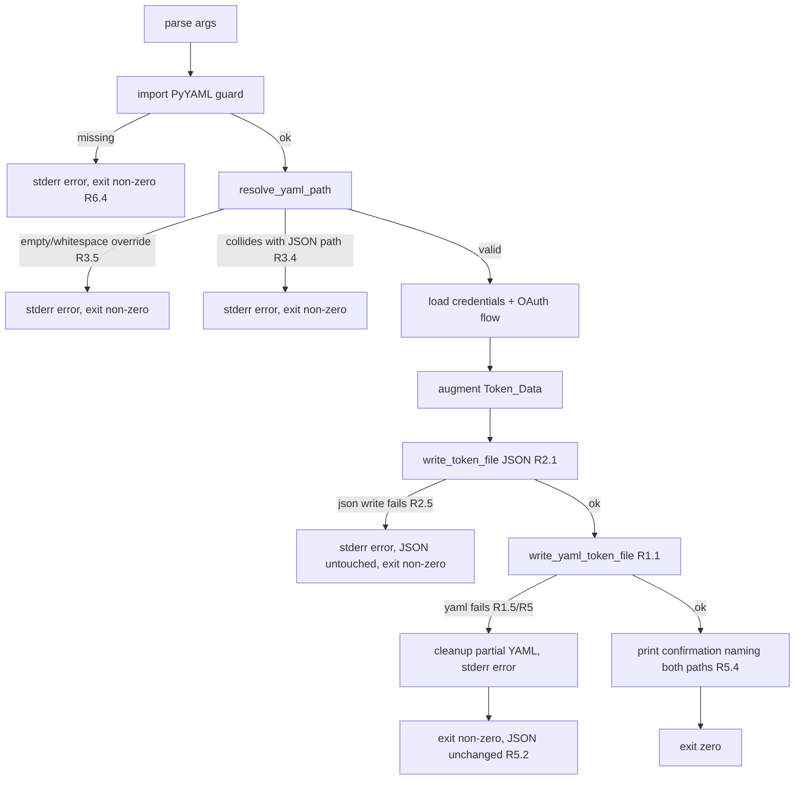

# Design Document

## Overview

This feature adds a YAML output to the `broker-token` CLI. After the OAuth2 flow completes, the CLI already writes `Token_Data` to a JSON file (`token.json` by default). This design adds a second serialization of the *same* `Token_Data` to a YAML file, produced **in addition to** the JSON file during a single run. In the YAML file, all token fields are nested under a single top-level wrapper key named `token`; the JSON file stays a flat top-level mapping with no wrapper key. Both files carry identical field values, and the existing JSON output and its downstream consumer (`token_refresher`) remain byte-for-byte unchanged.

The design centers on four concerns:

1. **A new YAML serializer** (`write_yaml_token_file`) that writes valid YAML with owner-only file permissions and no partial files on failure.
2. **Path resolution** that derives a YAML path from the JSON path, supports an override argument, and validates the result *before* any file is written.
3. **Ordering and failure semantics** that guarantee the JSON file is never left partial or altered by a YAML failure, and that partial YAML files are cleaned up.
4. **Dependency declaration** for PyYAML in both `pyproject.toml` and `requirements.txt`, with a graceful error when the library is absent.

### Requirements coverage summary

| Requirement | Addressed by |
| --- | --- |
| R1 Write YAML | `write_yaml_token_file`, `main()` write ordering |
| R2 Preserve JSON | Unchanged `write_token_file`, JSON written independently of YAML args |
| R3 YAML path resolution | `resolve_yaml_path` + validation gate in `main()` |
| R4 Protect sensitive fields | `chmod 0o600` in writer, no secret echoing, redaction marker |
| R5 Handle YAML failures | Atomic temp-write + cleanup, stderr messages, exit codes |
| R6 PyYAML dependency | `pyproject.toml`, `requirements.txt`, import guard |

## Architecture

The CLI keeps its existing linear flow (parse args → load credentials → OAuth → augment token → write). This feature inserts a **path-validation gate** early (right after argument parsing, before any network work is wasted where cheap) and a **YAML write step** after the JSON write.



### Key design decisions

- **Validate the YAML path before writing either file (R3.4, R3.5).** Path validation is pure and cheap. Doing it up front guarantees the "write neither file" outcome required for collision and invalid-override cases, and avoids writing JSON only to abort on a bad YAML path. The gate runs immediately after argument parsing.
- **Write JSON first, YAML second (R2, R5.2).** The JSON file and its consumer are the established contract. Writing JSON first means a YAML failure can never corrupt or alter JSON — the JSON file is already complete and closed. The YAML step then either succeeds or cleans up after itself.
- **Atomic YAML write via temp file + rename (R1.5, R5.3).** YAML is serialized in memory, written to a temporary file in the same directory, `chmod`ed to `0o600`, then atomically renamed over the destination. A failure at any stage removes the temp file, so no partial or truncated YAML file is ever visible at the destination path.
- **Permissions applied before the file is visible (R4.1, R4.2).** Because the temp file is `chmod`ed before the rename, the destination never appears with looser-than-owner-only permissions. If `chmod` fails, the temp file is deleted and the CLI exits non-zero.
- **Never echo secrets (R4.3, R4.4).** The confirmation and error messages name file paths only. No code path prints `Token_Data` values. A `REDACTION_MARKER` constant is available for any future output that would otherwise include a `Sensitive_Field`.

## Components and Interfaces

### JSON_Writer — `write_token_file(path, token_data)` (unchanged)

Existing function, retained verbatim:

```python
def write_token_file(path: str, token_data: dict) -> None:
    with open(path, "w") as f:
        json.dump(token_data, f, indent=4)
```

Kept as-is to satisfy R2.1 and R2.3 (4-space indent, deep equality with prior output). No YAML-specific argument reaches this function, satisfying R2.4.

### YAML_Writer — `write_yaml_token_file(path, token_data)` (new)

```python
def write_yaml_token_file(path: str, token_data: dict) -> None:
    """Serialize *token_data* to *path* as YAML with owner-only permissions.

    Writes atomically via a temporary file in the destination directory,
    applies 0o600 permissions before the file becomes visible, then renames
    it into place. On any failure, removes the temporary file so no partial
    YAML file is left behind.
    """
```

Behavior:
- Wrap `token_data` under a single top-level `token` key and serialize with `yaml.safe_dump({"token": token_data}, default_flow_style=False, sort_keys=False)`, so the YAML file parses back to `{"token": Token_Data}` (R1.1, R1.2). Serialization happens in memory (or into the temp file) so a serialization error occurs before the destination is touched (R1.2, R1.5).
- Create the temp file via `tempfile.mkstemp(dir=os.path.dirname(path) or ".")`. Using the same directory guarantees the final `os.replace` is atomic on POSIX.
- `os.chmod(temp_fd/temp_path, 0o600)` so the owner gets read/write and no group/other access (R4.1). If `chmod` raises, delete the temp file and re-raise a permission error (R4.2).
- `os.replace(temp_path, path)` renames atomically, overwriting any existing YAML file (R1.6).
- On *any* exception, remove the temp file in a `finally`/`except` cleanup path (R1.5, R5.3), then re-raise so `main()` can report and exit non-zero.

The function raises on failure; it does not print. All user-facing messaging and exit codes live in `main()`.

### Path resolver — `resolve_yaml_path(json_path, yaml_arg)` (new)

```python
def resolve_yaml_path(json_path: str, yaml_arg: str | None) -> str:
    """Return the YAML output path, or raise ValueError on an invalid path.

    - If yaml_arg is provided and non-blank, it takes precedence (R3.3).
    - If yaml_arg is empty or whitespace-only, raise ValueError (R3.5).
    - Otherwise derive from json_path: replace the extension in the final
      path segment with '.yaml' (R3.1), or append '.yaml' if the final
      segment has no '.' (R3.2).
    - If the resolved path equals json_path, raise ValueError (R3.4).
    """
```

Derivation detail (R3.1/R3.2): operate on the final path segment only. If the final segment (basename) contains a `.`, replace from its last `.` to the end with `.yaml`; otherwise append `.yaml` to the full path. This keeps directory components intact and matches the requirement's "final path segment" wording — e.g. a directory like `my.dir/token` (no dot in the basename `token`) yields `my.dir/token.yaml`, not `my.yaml`.

The resolver is pure and raises `ValueError` for the invalid cases. `main()` translates the exception into a stderr message and non-zero exit, writing neither file (R3.4, R3.5).

### CLI argument — `--yaml-file` / `-y` (new)

Added to the existing `argparse` parser:

```python
parser.add_argument(
    "--yaml-file", "-y",
    default=None,
    help="Path to write the token YAML (default: derived from --token-file)",
)
```

`default=None` means "no YAML argument provided," which triggers derivation (R3.1/R3.2). The JSON argument (`--token-file`/`-o`, default `token.json`) is untouched, preserving R2.2.

### PyYAML import guard (new)

```python
try:
    import yaml
except ImportError:
    print(
        "Error: PyYAML is required but not installed. "
        "Install it with 'pip install pyyaml'.",
        file=sys.stderr,
    )
    sys.exit(1)
```

Placed so that an invocation with PyYAML missing reports to stderr and exits non-zero (R6.4). The import can live at module top with the guard, or inside `main()` before path resolution; the design uses a guarded import so the failure is a clean CLI error rather than a traceback.

### Orchestration in `main()`

New/changed steps, in order:

1. Parse args (existing) plus the new `--yaml-file`.
2. Guard the PyYAML import (R6.4).
3. `resolve_yaml_path(token_file, args.yaml_file)`; on `ValueError`, print to stderr and `sys.exit(1)` — no files written (R3.4, R3.5).
4. Load credentials + OAuth flow + augment `Token_Data` (existing).
5. `write_token_file(token_file, token_data)`; on failure, print to stderr, leave any pre-existing JSON unchanged, `sys.exit(1)` (R2.5).
6. `write_yaml_token_file(yaml_path, token_data)`; on failure, the writer has already removed any partial file — print a stderr message including the YAML path and cause, then `sys.exit(1)`, leaving the JSON file unchanged (R1.5, R5.1, R5.2, R5.3, R4.2).
7. On success, `print(f"Token written to {token_file} and {yaml_path}")` and exit zero (R5.4).

## Data Models

### Token_Data

`Token_Data` is a `dict[str, str]` produced by the OAuth2 flow (`get_access_token`) and augmented in `main()`. Fields serialized to both files:

| Field | Source | Type | Sensitive |
| --- | --- | --- | --- |
| `access_token` | OAuth response | str | yes |
| `refresh_token` | OAuth response | str | yes |
| `expiration_timestamp` | derived, ISO 8601 string | str | no |
| `refresh_token_expiration_timestamp` | derived, ISO 8601 string | str | no |
| `client_id` | credentials | str | yes |
| `client_secret` | credentials | str | yes |

The OAuth response may include additional keys (e.g. `expires_in`, `token_type`); the design writes whatever `Token_Data` contains to *both* files identically, so the YAML and JSON field sets are equal in a given run (R1.3). Timestamp fields are already normalized to ISO strings in `main()` before either write, ensuring both serializers see the same plain-string values (R1.4).

### On-disk structure

The two files differ only in whether the fields are wrapped:

- **YAML on-disk structure** is `{"token": Token_Data}` — a mapping with a single top-level `token` wrapper key whose value is the `Token_Data` mapping.
- **JSON on-disk structure** is the flat `Token_Data` mapping itself — the field names sit at the top level with no wrapper key (R2.4).

So for a given run, the mapping found under the YAML `token` key equals the JSON top-level mapping, and both equal `Token_Data`.

### Sensitive_Field set

`{access_token, refresh_token, client_id, client_secret}` — values written only into the files, never to stdout/stderr (R4.3). `REDACTION_MARKER = "***REDACTED***"` is defined for any output that would otherwise carry a sensitive value (R4.4).

### Path model

- `json_path`: from `--token-file`/`-o`, default `token.json`.
- `yaml_arg`: from `--yaml-file`/`-y`, default `None`.
- `yaml_path`: output of `resolve_yaml_path`, guaranteed non-blank and distinct from `json_path`.

## Correctness Properties

*A property is a characteristic or behavior that should hold true across all valid executions of a system — essentially, a formal statement about what the system should do. Properties serve as the bridge between human-readable specifications and machine-verifiable correctness guarantees.*

The properties below were derived from the acceptance criteria after a redundancy-elimination pass: field-set criteria (R1.1, R1.3) are subsumed by the stronger round-trip and cross-serializer equality properties; the two path-derivation branches (R3.1, R3.2) are combined; and the YAML-failure criteria (R1.5, R5.2, R5.3) are handled together as edge-case tests rather than properties (see Testing Strategy).

### Property 1: YAML round-trip preserves Token_Data

*For any* `Token_Data` mapping of string keys to string values, writing it with `write_yaml_token_file` and then parsing the file with `yaml.safe_load` SHALL produce a mapping equal to `{"token": Token_Data}` — that is, a single top-level `token` key whose value is a mapping equal to the original `Token_Data`.

**Validates: Requirements 1.1, 1.2**

### Property 2: YAML and JSON parse to equal content

*For any* `Token_Data`, writing it to both a YAML file and a JSON file in the same run and then parsing each file SHALL yield: the mapping under the YAML `token` key equal to the JSON top-level mapping and equal to the original `Token_Data` (identical key sets and identical values).

**Validates: Requirements 1.3, 1.4**

### Property 3: YAML write overwrites any existing file

*For any* two `Token_Data` values A and B, writing A and then B to the same YAML path SHALL leave the file parsing to `{"token": B}`, with no residual keys or values from A under the `token` key.

**Validates: Requirements 1.6**

### Property 4: JSON output is independent of YAML arguments

*For any* `Token_Data`, the JSON file content produced when a YAML path argument is supplied SHALL be byte-for-byte identical to the JSON file content produced when no YAML argument is supplied.

**Validates: Requirements 2.3, 2.4**

### Property 5: YAML path derivation from the JSON path

*For any* JSON path with no override supplied: if the final path segment contains a `.`, the derived YAML path SHALL equal the JSON path with the characters from the last `.` in that segment to the end replaced by `.yaml`; if the final path segment contains no `.`, the derived YAML path SHALL equal the JSON path with `.yaml` appended. In both cases the directory portion of the path SHALL be unchanged.

**Validates: Requirements 3.1, 3.2**

### Property 6: A non-blank override path takes precedence

*For any* JSON path and *any* non-blank YAML override argument, `resolve_yaml_path` SHALL return the override argument unchanged, regardless of the JSON path.

**Validates: Requirements 3.3**

### Property 7: YAML file has owner-only permissions

*For any* `Token_Data`, after `write_yaml_token_file` completes successfully on a POSIX system, the file's permission bits SHALL equal `0o600` (owner read/write; no read, write, or execute for group or other).

**Validates: Requirements 4.1**

### Property 8: No sensitive value is emitted to stdout or stderr

*For any* `Token_Data`, running the write-and-confirm path SHALL NOT emit any `Sensitive_Field` value (`access_token`, `refresh_token`, `client_id`, `client_secret`) to standard output or standard error; and the redaction helper applied to any mapping SHALL preserve every field name while replacing each `Sensitive_Field` value with the redaction marker.

**Validates: Requirements 4.3, 4.4**

## Error Handling

Error handling follows a "validate early, fail loud, leave no mess" discipline. All user-facing messages go to stderr; secret values never appear in any message.

| Condition | Requirement | Handling | Exit |
| --- | --- | --- | --- |
| PyYAML not installed | R6.4 | Guarded import prints a clear "PyYAML required" message to stderr | non-zero |
| YAML override empty/whitespace | R3.5 | `resolve_yaml_path` raises `ValueError`; `main()` prints "invalid YAML path" to stderr; no file written | non-zero |
| YAML path equals JSON path | R3.4 | `resolve_yaml_path` raises `ValueError`; `main()` prints "output paths conflict" to stderr; no file written | non-zero |
| JSON write fails | R2.5 | `main()` prints error to stderr; pre-existing JSON left unchanged | non-zero |
| YAML serialization/write fails | R1.5, R5.1, R5.2, R5.3 | Writer removes the temp file (no partial destination file); `main()` prints a message including the YAML path and the failure cause; JSON left unchanged | non-zero |
| Cannot set YAML permissions | R4.2 | Writer deletes the partially written temp file; `main()` prints a "permissions could not be applied" message | non-zero |
| Both files written | R5.4 | Print confirmation naming the JSON and YAML paths (paths only, no secrets) | zero |

Atomicity guarantees:
- The destination YAML path only ever appears via `os.replace` of a fully written, `0o600` temp file. There is no window in which a partial or loosely permissioned file exists at the destination.
- Because JSON is written and closed before the YAML step begins, no YAML-side failure can alter the JSON file.

## Testing Strategy

Tests use `pytest` with the `tmp_path` fixture and follow the existing conventions in `tests/test_broker_token.py`: imports inside test methods, load-and-assert-equality, class-grouped tests. A new test class (e.g. `TestWriteYamlTokenFile`, `TestResolveYamlPath`, `TestCliOutput`) is added per component.

### Property-based tests

PyYAML-based serialization is a pure input/output transformation over structured data, so property-based testing applies. The tests use **Hypothesis** (the standard PBT library for Python) — the design does not implement property testing from scratch. Each property test:
- Runs a minimum of 100 iterations (Hypothesis default `max_examples` is >= 100; set explicitly where needed).
- Is tagged with a comment referencing its design property, format: `# Feature: store-token-in-yaml-file, Property {n}: {property text}`.
- Is implemented as a single property-based test per property.

Generators: `Token_Data` is generated as a dict from a fixed/random subset of the known field names to `st.text()` values (including empty strings, unicode, and YAML-significant characters such as `:`, `#`, `-`, quotes, and leading/trailing whitespace) to exercise serializer edge cases. Path generators produce basenames with and without dots and with nested directories.

Mapping of properties to tests:
- Property 1 (YAML round-trip) — generate `Token_Data`, write, `yaml.safe_load`, assert equal to `{"token": token_data}`.
- Property 2 (YAML/JSON equality) — write both, assert `yaml.safe_load(y)["token"] == json.load(j) == token_data`.
- Property 3 (overwrite) — write A then B, assert `yaml.safe_load(y) == {"token": B}` with no residual A keys under `token`.
- Property 4 (JSON independence) — produce JSON with and without a YAML arg, assert files byte-identical.
- Property 5 (path derivation) — generate JSON paths, assert derived YAML path per the dotted/dotless rule with directory preserved.
- Property 6 (override precedence) — generate non-blank override, assert `resolve_yaml_path` returns it.
- Property 7 (permissions) — write, `os.stat`, assert `S_IMODE == 0o600`; `pytest.mark.skipif` on non-POSIX.
- Property 8 (no secret leakage) — capture stdout/stderr via `capsys`, assert no sensitive value substring appears; unit-test the redaction helper directly.

### Unit / edge-case tests (example-based)

These cover failure modes and specific behaviors where a "for all inputs" statement adds little:
- **YAML write failure** (R1.5, R5.1, R5.2, R5.3): monkeypatch `yaml.safe_dump` (or `os.replace`) to raise; assert the destination YAML path does not exist, a pre-existing JSON file's bytes are unchanged, stderr includes the YAML path and cause, and exit is non-zero.
- **Permission failure** (R4.2): monkeypatch `os.chmod` to raise; assert the destination file is absent and a permission error message is produced.
- **JSON write failure** (R2.5): monkeypatch to raise during JSON write; assert stderr message and pre-existing JSON unchanged.
- **Path collision** (R3.4): `resolve_yaml_path` with override equal to JSON path raises `ValueError`; at CLI level neither file is written and exit is non-zero.
- **Invalid override** (R3.5): `''`, `'   '`, `'\t'` raise `ValueError`; CLI writes neither file, exits non-zero.
- **Missing PyYAML** (R6.4): simulate `ImportError` for `yaml`; assert stderr message and non-zero exit.
- **JSON format preserved** (R2.1, R2.3): existing `TestWriteTokenFile` round-trip and overwrite tests continue to pass; add an assertion on 4-space indentation.
- **Default JSON path** (R2.2): parse args without `--yaml-file`; assert `token_file == "token.json"`.
- **Success confirmation** (R5.4): run the success path; assert stdout names both paths and exit is zero.

### Configuration / smoke tests

- **PyYAML in pyproject.toml** (R6.1): read `pyproject.toml`; assert a `pyyaml` entry with a `>=` minimum-version specifier is present in `[project].dependencies`.
- **PyYAML in requirements.txt** (R6.2): read `requirements.txt`; assert a `pyyaml` line whose specifier matches the one in `pyproject.toml`.
- **Import succeeds** (R6.3): `import yaml` in the test environment does not raise.
